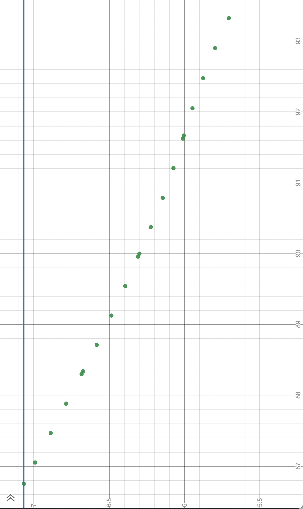

# Write up for *Control and Trajectory Tracking for Autonomous Vehicle* project
## Introduction
In this project, we need to design and code a PID controller for the CARLA simulator.

## How to run
Start the CARLA simulator by running the following in a new terminal
```
su - student
cd /opt/carla-simulator/
SDL_VIDEODRIVER=offscreen ./CarlaUE4.sh -opengl
```

Compile controller (the program that will show the simulator) in a new terminal
```
cd nd013-c6-control-starter/project
./install-ubuntu.sh
cd pid_controller/
rm -rf rpclib
git clone https://github.com/rpclib/rpclib.git
cmake .
make
```

Run the controller
```
cd nd013-c6-control-starter/project
./run_main_pid.sh
```
Press `ctrl + C` to stop. Run `./run_main_pid.sh` multiple times if the simulator fails to start.

### Structure
```
project\pid_controller
  - behavior_planner_FSM.h: state machine for the car
  - cost_functions.h: algorithms to determine the the best path by calculating the cost of possible paths the car can take
  - cubic_spiral.h: algorithm to calculate the cubic spiral. Used to calculate the path to avoid collision with parked cars.
  - integral.h: functions to calculate the integral
  - main.cpp: the main function for the controller
  - motion_planner.h: algorithm to determine the best path (spiral) to travel
  - pid_controller.h: PID controller algorithm
  - planning_param.h: Parameters for the car's algorithm
  - plot_utils.h: Utilities for plotting the yaw and throttle over time
  - spiral_base.h: Base class for cubic spiral
  - structs.h: Data structures for the car's algorithms
  - spiral_equations.h: Values to calculate the cubic spirals
  - velocity_trajectory_generator.h: Determines what's the right velocity for the current state
```

## Screenshot of simulator


## Configuration
### Collision radius
The collision radius has been changed from 1.5 to 1.6 so that the car moves steers away from the parked cars sooner.

## Calculating error and output
### Error steering and steering output
This is the x-y plot (x_points and y_points) from the cubic spiral calculation. The vertical line is the base line for cross track error (CTE). It is based on the first point on the cubic spiral.





Therefore, CTE (error for steering) is the first point of the cubic spiral minus the car's current y position (**y_point[0] - y_position**). The CTE is passed into the yaw PID controller.

The steering output (how much to turn) is the total error from the yaw PID controller.

### Error throttle and throttle output
The error for throttle is the desired velocity (the last value in the vector **v_point**) minus the car's current velocity (the variable **velocity**). The error value is passed into the throttle PID controller.

The throttle output (how much gas to press) is the total error from the throttle PID controller.

## Data from simulator
### Steering


In the graph above, error steering is the cross track error (CTE). Since the car is traveling in the x-axis, the CTE is the waypoint's y-axis minus the car's y-axis. Steering output is how much to turn the steering wheel. That's calculated by the total PID error.

### Throttle


* The error for throttle is unstable at first but stablizes in a while.
* The throttle output is also unstable at first but stablizes at 0.3.
* The break output is close to 0 because it was never really used.

### Analysis
**What is the effect of the PID according to the plots, how each part of the PID affects the control command?**

* Only proportion and derivative was used. The integral error was getting really big because it accumulated all the error. That error wasn't really necessary here because the large error caused more aggressive steering.

* Proportion was important because it's the current cross track error (CTE)

* Derivative was important because we need to know how much the CTE was changing.

**How would you design a way to automatically tune the PID parameters?**

Start proportion and derivative at an inital value and increment the derivative by 0.01 (or another value). Analyze the errors from the waypoint and the actual path the car took. The larger the error, the more aggressive the car was turning to adjust for the error.

**PID controller is a model free controller, i.e. it does not use a model of the car. Could you explain the pros and cons of this type of controller?**

Pros:

1) The PID values will probably work on cars with similar shape and length.
2) The PID values will need very little tuning on cars with similar shape and length.

Cons:

1) The PID values will not work on cars with different shape and length. It will probably cause the car to crash.
2) You'll need to manage different PID values for different types of cars.

**(Optional) What would you do to improve the PID controller?**
* Figure out how to make it work if it is travelling on x-axis
* Figure out how to make a smooth turn.